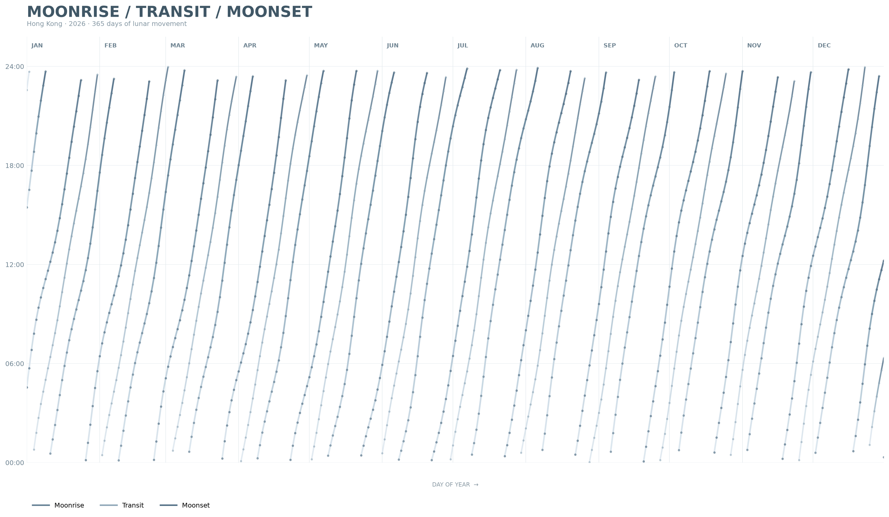

# Moonrise and Moonset



## The phenomenon

The phenomenon I looked at is the changing time of the Moon's rise, transit, and set over one year. I chose this because the Moon does not appear at the same time every day. Its daily movement creates a changing pattern that can be observed through numerical data.

The dataset contains three times for each day: moonrise, lunar transit, and moonset. I converted the recorded times from `HH:MM` strings into decimal hours so that they could be plotted as numerical values. Some records contain missing values, which are kept as missing rather than replaced with invented values.

## The source

The data comes from the Hong Kong Observatory Open Data service:

https://data.weather.gov.hk/weatherAPI/opendata/opendata.php?dataType=MRS&year=2026&rformat=csv

The CSV contains 365 rows, with one row representing one day in 2026. Each row contains the date, moonrise time, lunar transit time, and moonset time. The times are recorded in hours and minutes (`HH:MM`) for Hong Kong.

## What the picture shows

The picture maps the 365 days of 2026 from left to right and maps time of day from 00:00 to 24:00 vertically. The three changing lines represent moonrise, lunar transit, and moonset, allowing the daily and seasonal changes to form a continuous wave-like pattern.

The picture hides the original clock-time format and the exact date labels for every single day. It also converts the times into decimal hours and breaks lines where there are large jumps around midnight, so the original table structure and some of the precise relationships between individual records are no longer visible.

## Run it

```text
uv run fetch.py
uv run plot.py